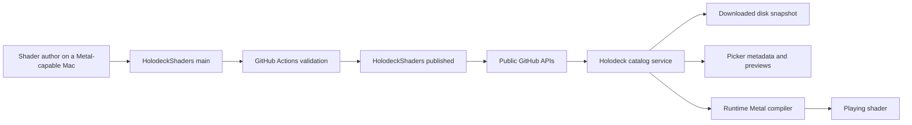
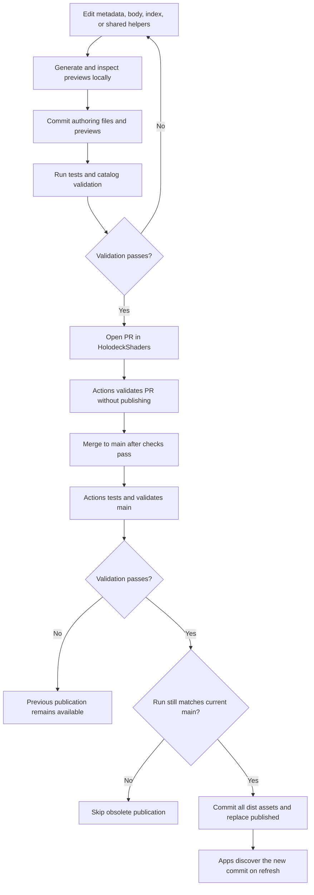
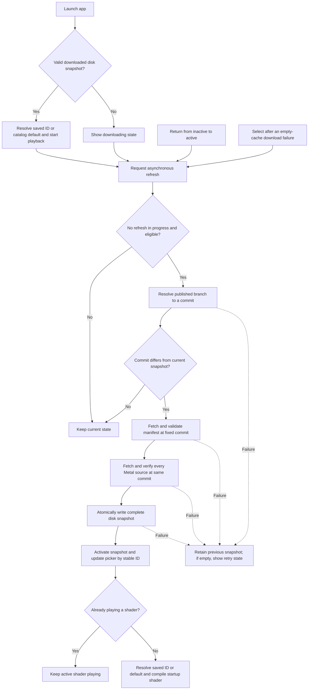
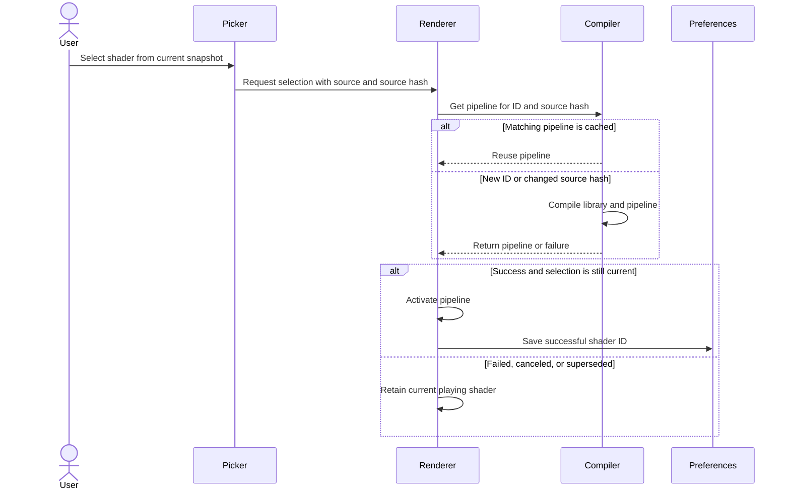

# Shader repositories and catalog workflow

[HolodeckShaders](https://github.com/hbmartin/HolodeckShaders) is the public source of truth for shader code, metadata, ordering, defaults, and previews. [Holodeck](https://github.com/hbmartin/Holodeck) owns the tvOS player and downloads validated publications directly from GitHub. A compatible catalog update needs no app release.

The app ships **no bundled catalog, Metal sources, or preview images**. First launch requires internet. Later launches can start from a previously downloaded, validated disk snapshot. If tvOS evicts that cache, another download is required.

## Repository responsibilities

| Repository / branch | Owns | How it changes |
| --- | --- | --- |
| `HolodeckShaders/main` | Shader bodies, shared helpers, metadata, committed previews and fingerprints, authoring tools | Authors open PRs; merging triggers validation and publication |
| `HolodeckShaders/published` | Generated manifest, complete Metal libraries, PNG previews | GitHub Actions replaces the branch with one complete validated commit |
| `Holodeck` | Downloading, validation, cache, picker, runtime compilation, playback, tests | App code changes follow the app's normal release process |



There is no backend or user login. GitHub's public APIs deliver the content. Authoring and publishing use the contributor's normal GitHub permissions.

## Authoring layout

In a HolodeckShaders checkout:

```text
index.json                       # Ordered IDs and defaultShaderID
shared/common.metal              # Uniforms, vertex entry point, shared helpers
shared/material.metal            # Optional material helpers
shared/fragment.metal            # Fragment entry point
shaders/<id>/metadata.json
shaders/<id>/body.metal
shaders/<id>/preview.png          # Generated and committed
shaders/<id>/preview.json         # Fingerprint, PNG hash, rendering settings
tools/catalog.py                 # Assembly, generation, validation
tools/render-preview.swift       # Local Metal preview renderer
```

The eight migrated IDs are `plasma`, `aurora`, `waves`, `kaleidoscope`, `starfield`, `chrome`, `brushed-gold`, and `iridescent`, in that order. Plasma remains the default. Keep IDs stable: the app uses them for saved selections and picker focus. A display-name change does not require a new ID.

## Add a shader

HolodeckShaders also owns an authoring-only snippet and reference library. Start with its `docs/shader-library.md` and `docs/shader-authoring.md`; `tools/library.py` supports search, scaffolding, byte-preserving local imports, example compilation and sampled renders. Technical validation and editorial publication selection are separate.

Schema version 1 accepts optional ordered `collections` (`id`, `name`, `description`, `shaderIDs`) and shader `discovery` (`tags`, `moods`, `motion`). Collections can overlap, but members must be published IDs. All retains manifest order. Apps store discovery strings openly, allowing future vocabulary, and read older cached snapshots without migration. The producer validates its documented vocabulary. Authoring `reuse` links never enter publication assets.

Both app targets filter locally without altering playback, pending selection or animation time. Missing collection selections reset to All after refresh; unavailable mood/motion selections reset to Any. Mac search also matches discovery labels and tags. TV selector dismissal returns focus to its control; empty results leave filters and Reset usable. Preserve the existing per-platform startup and source-update policies.

See [the implementation validation record](shader-library-validation.md) for compatibility, platform checks and remaining release checks.

Use a Mac with Xcode, the tvOS SDK, a Metal-capable GPU, and Python 3. The Python tools use only the standard library. All commands in this section run in **HolodeckShaders**, not the app repository.

### 1. Create an authoring branch and files

```sh
git clone git@github.com:hbmartin/HolodeckShaders.git
cd HolodeckShaders
git switch -c add-ripple
mkdir -p shaders/ripple
```

Create `shaders/ripple/metadata.json`:

```json
{
  "id": "ripple",
  "name": "Ripple",
  "category": "PROCEDURAL",
  "description": "Animated rings flowing across a field of color.",
  "colors": [[0.1, 0.3, 0.8], [0.8, 0.2, 0.6]],
  "shared": ["common", "fragment"]
}
```

IDs must be unique lowercase words separated by hyphens, up to 100 characters. The directory, metadata ID, and index ID must agree. Names and descriptions must be nonempty, with limits of 200 and 2,000 characters respectively. `colors` contains exactly two RGB triples with each component in `0...1`; these provide the card gradient when a preview is unavailable.

The supported categories are `PROCEDURAL` and `3D MATERIAL`. Use `shared: ["common", "material", "fragment"]` when the body needs material helpers; those are the only two supported shared-file combinations.

Create `shaders/ripple/body.metal`, for example:

```metal
float3 shade(float2 p, float time, float2 pixel) {
    float rings = 0.5 + 0.5 * sin(length(p) * 35.0 - time * 2.0);
    return mix(float3(0.1, 0.3, 0.8), float3(0.8, 0.2, 0.6), rings);
}
```

`p` is centered, with Y pointing up and coordinates scaled by drawable height. `pixel` is the fragment's drawable position; `time` is animation time in seconds. Return linear RGB. The shared fragment clamps it to `0...1` and emits opaque alpha into the app's sRGB drawable.

The assembler concatenates common helpers, optional material helpers, the body, and the fragment helper. Authors implement `shade`; the shared files supply `vertexShader`, `fragmentShader`, and this 16-byte uniform contract at buffer 0:

```metal
struct ShaderUniforms {
    float2 resolution;
    float time;
    float padding;
};
```

Preserve that contract for released apps. Check the existing shaders before changing shared helpers, since a shared edit can affect several shaders.

### 2. Add the stable ID to the index

Append `"ripple"` to the `shaders` array in `index.json`, or place it at the desired picker position. Preserve the existing IDs and `defaultShaderID: "plasma"` unless intentionally changing the catalog default. The default must refer to an indexed shader; the catalog must contain between 1 and 500 unique IDs.

### 3. Generate previews and inspect the result

```sh
python3 tools/catalog.py generate
```

This renders **every indexed shader**, writing its `preview.png` and `preview.json`. Inspect the new PNG and any previews affected by shared edits. Previews use 1280×720, animation time 3 seconds, and `bgra8Unorm_srgb` to match the app's sRGB output behavior.

The fingerprint covers the assembled source, the preview renderer's source, and rendering settings. Source, shared dependency, renderer, or settings changes require regeneration. Metadata-only name, description, or card-color edits do not change the rendered source fingerprint. The PNG's own SHA-256 is also recorded, so replacing an image without updating its record fails validation.

### 4. Commit, then validate the publication

```sh
git add index.json shaders shared
git commit -m "Add Ripple shader and preview"
python3 tools/test_catalog.py
python3 tools/catalog.py validate
```

Review the staged changes before committing, including any previews regenerated for existing shaders. Commit changes to `tools/` too if you intentionally changed the renderer or generation settings.

Validation uses Git history to derive dates and the authoring revision, so run the final validation **after committing**. It checks metadata, IDs, defaults, referenced assets, preview fingerprints and hashes, source sizes, and tvOS Metal compilation. It writes:

```text
dist/catalog.json
dist/sources/<id>.metal
dist/previews/<id>.png
```

`dist/` and `.cache/` are ignored build outputs. Do not edit or commit them. `python3 tools/catalog.py build` assembles and checks artifacts without the Metal compilation step; use `validate` for the complete pre-publication check.

If validation fails, fix the authoring files, regenerate affected previews, commit the fix, and validate again. Also check animation in the app: the preview records a single frame and cannot demonstrate motion over time.

### 5. Open a shader-repository PR and merge

Push the authoring branch and open a PR against `HolodeckShaders/main`. The PR workflow validates without publishing. After merge, the main-branch workflow validates again and publishes the complete snapshot. A manual run of the **Validate and publish catalog** workflow on `main` can also publish; rerunning validation on a PR does not publish it.

Once publication succeeds, an app with connectivity receives Ripple on its next eligible refresh. Users select it from the picker; publishing does not automatically replace their playing shader.

## Publication process



The workflow runs on macOS with full Git history. Publication jobs are serialized, and a run checks that its authoring commit is still the current `main` before publishing. The generated manifest and all assets enter `published` in a single commit, so the branch never exposes a partially uploaded snapshot.

Treat `published` as generated output. To roll back a shader, restore the desired authoring content on `main`, regenerate previews as needed, and let validation publish a new snapshot. Do not manually patch individual files on `published`.

## Manifest and revision contract

`catalog.json` uses schema version 1. It contains `defaultShaderID`, `sourceRevision`, and an ordered `shaders` array. Each entry has:

| Fields | Meaning |
| --- | --- |
| `id`, `name`, `category`, `description`, `colors` | Stable identity and picker metadata |
| `updatedAt` | UTC ISO-8601 date derived from Git history |
| `sourcePath`, `sourceSHA256` | Complete Metal library at `sources/<id>.metal` and its hash |
| `previewPath`, `previewSHA256` | PNG at `previews/<id>.png` and its hash |

`sourceRevision` identifies the **authoring commit on main**. The app separately stores the **published commit** it downloaded. These commits differ because publication builds a new commit containing generated assets.

`updatedAt` is the committer date of the latest commit affecting a shader's metadata, body, or declared shared helpers. Shared edits therefore update all dependent shaders' dates. Preview-only regeneration does not change the date. Initial migration dates come from the migration commit. Authors do not manually enter `updatedAt` or manifest hashes.

Keep schema version 1 and the rendering contract compatible with released apps. New shaders and compatible metadata/source updates require no app release; an incompatible schema or rendering contract requires corresponding app support. An older client rejects an unsupported schema and retains its prior downloaded snapshot.

## App startup and refresh control flow

The catalog service injects networking, storage, and refresh time. Its current snapshot is optional until a valid disk snapshot or download is available.



With a usable snapshot, refresh attempts are throttled to once per 15 minutes, including failed attempts. This is triggered by launch and actual foreground returns; there is no polling timer. Without a usable snapshot, Select can retry immediately. Concurrent refresh requests do not start overlapping downloads.

The app first requests:

```text
GET https://api.github.com/repos/hbmartin/HolodeckShaders/git/ref/heads/published
```

It then fetches the manifest and assets through the repository Contents API, using the resolved commit as `ref` and requesting raw contents:

```text
GET https://api.github.com/repos/hbmartin/HolodeckShaders/contents/catalog.json?ref=<published-commit>
GET https://api.github.com/repos/hbmartin/HolodeckShaders/contents/sources/<id>.metal?ref=<published-commit>
GET https://api.github.com/repos/hbmartin/HolodeckShaders/contents/previews/<id>.png?ref=<published-commit>
```

Every asset belongs to that fixed commit even if `published` changes during download. An unchanged publication skips downloading the catalog again.

The app rejects unsupported schemas, invalid metadata or paths, duplicate IDs, missing defaults or sources, and source hash mismatches. It downloads and verifies **all sources** before writing and activating a snapshot. Network, validation, cancellation, or disk-write failures retain the previous snapshot. A snapshot is a single atomically written `snapshot.json` containing the manifest, sources, and publication revision in the app's `ShaderCatalog` cache directory.

## Selection, pipeline reuse, and previews



Catalog refresh updates the picker and preserves focus by stable ID. Playback keeps its existing pipeline, including when that ID disappears from the catalog. On the next launch, a saved ID missing from the current snapshot resolves to the manifest default. Pending selections retain their selected source; a catalog refresh does not replace a selection already in progress.

Pipelines are cached by shader ID plus source hash. Identical source reuses its compiled pipeline; revised source under the same ID compiles again when selected. Only the latest successful selection activates and updates the saved preference.

Previews download on demand, independently of source activation, and cache as `preview-<SHA-256>.png`. The app verifies image hashes and uses the card gradient on missing or failed images. Reused cells cancel their prior image task and check their represented shader before displaying a result. Cards format `updatedAt` as a localized, abbreviated date.

## Failure behavior and verification

| Situation | Result |
| --- | --- |
| Shader-repository validation fails | Previous `published` snapshot remains available |
| GitHub is unavailable or rate-limited, with a valid app cache | Browsing and playback continue from the downloaded snapshot |
| First launch has no valid cache and download fails | Download error and Select-to-retry state; no built-in shader fallback |
| Source download is incomplete or a hash is wrong | Candidate rejected; previous app snapshot retained |
| Preview fails to load | Card gradient remains; catalog and source selection remain usable |
| Refreshed source fails runtime compilation | Selection fails; current playing shader and saved successful ID remain |
| Active shader is removed from the catalog | Current playback continues; next launch resolves a missing saved ID to the default |

Holodeck's `HolodeckCore/Tests/HolodeckCoreTests/TestSupport/` catalog and images are recorded fixtures linked only to test targets. They support deterministic tests and are excluded from the shipping app. Ordinary app builds and tests do not fetch live catalog content. See the [app validation instructions](../README.md#validation) for simulator tests; verify actual preview generation on a Metal-capable Mac and animation in the app when changing shaders.

Implementation references:

- [Catalog model and validation](../HolodeckCore/Sources/HolodeckCore/ShaderCatalog.swift)
- [Networking, refresh, disk snapshots, and preview cache](../HolodeckCore/Sources/HolodeckCore/CatalogService.swift)
- [Startup, lifecycle, picker updates, and selection](../Holodeck/GameViewController.swift)
- [Pipeline compilation and reuse](../HolodeckCore/Sources/HolodeckCore/ShaderCompiler.swift)
- [Playback and selection cancellation](../HolodeckCore/Sources/HolodeckCore/Renderer.swift)
- [Shader authoring and publication tool](https://github.com/hbmartin/HolodeckShaders/blob/main/tools/catalog.py)
- [Publication workflow](https://github.com/hbmartin/HolodeckShaders/blob/main/.github/workflows/publish.yml)
